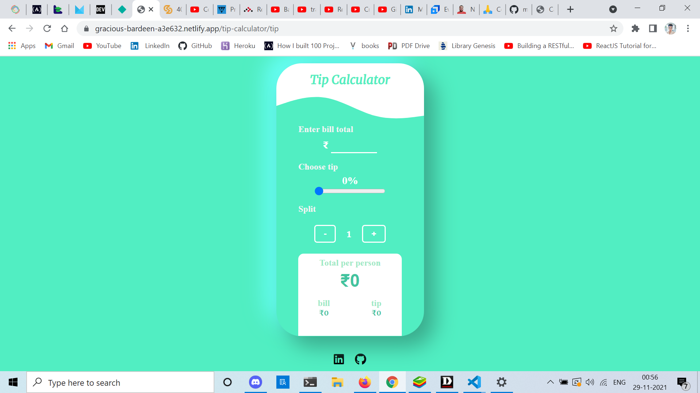
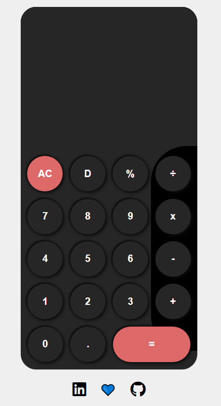

#JS-Tip-And-Normal-Calculator
This is a combined web app of Tip-Calculator & Normal-Calculator.

d### <a href="https://gracious-bardeen-a3e632.netlify.app/" target="_blank">**Live Demo 🚀**</a>

## Tech Stack

## ScreenShot

 

<video width="320" height="240" controls>
  <source src="5.mp4" type="video/mp4">
</video>
